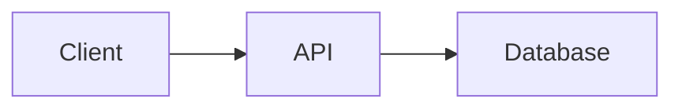
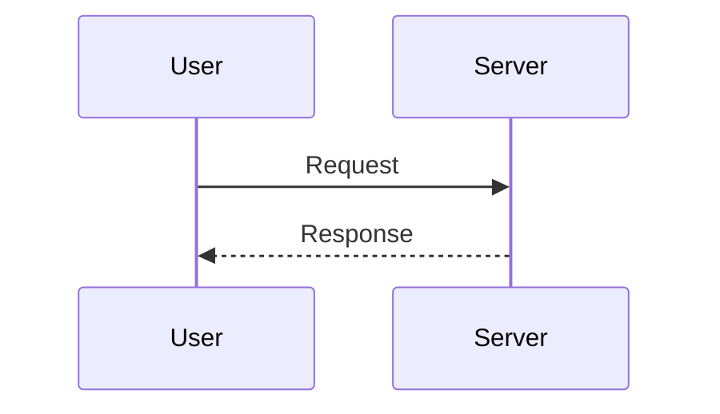

# Shareable Diagrams Implementation Plan

> **For agentic workers:** REQUIRED SUB-SKILL: Use superpowers:subagent-driven-development (recommended) or superpowers:executing-plans to implement this plan task-by-task. Steps use checkbox (`- [ ]`) syntax for tracking.

**Goal:** Build a GitHub Pages hosted SPA that encodes/decodes markdown documents with Mermaid diagrams via URL hash, plus a companion skill for coding assistants.

**Architecture:** Single Vite + React app. Hash present = viewer (decode + render with Comark). No hash = encoder page (markdown editor + preview + URL generation). A Node.js CLI script in `skills/` lets agents generate URLs. Content flows through gzip compression + base64url encoding using native platform APIs.

**Tech Stack:** Vite, React, TypeScript, @comark/react, @comark/react/plugins/mermaid, @comark/react/plugins/highlight, beautiful-mermaid, Shiki

---

## File Structure

| File | Responsibility |
|------|---------------|
| `src/lib/encode.ts` | Async: markdown string → base64url hash (CompressionStream + Uint8Array.toBase64) |
| `src/lib/decode.ts` | Async: base64url hash → markdown string (Uint8Array.fromBase64 + DecompressionStream) |
| `src/Viewer.tsx` | Reads hash, decodes, renders with Comark (mermaid + highlight plugins) |
| `src/Encoder.tsx` | Split-pane: textarea + live Comark preview + URL generation + copy button |
| `src/App.tsx` | Hash router: hash → Viewer, no hash → Encoder |
| `src/main.tsx` | React entry point |
| `src/style.css` | Global styles (GitHub-docs minimal) |
| `index.html` | Vite entry HTML |
| `vite.config.ts` | Vite config with base path for GH Pages |
| `tsconfig.json` / `tsconfig.app.json` / `tsconfig.node.json` | TypeScript configs |
| `package.json` | Dependencies and scripts |
| `public/favicon.svg` | Simple favicon |
| `skills/share-diagram/SKILL.md` | Skill definition for agents |
| `skills/share-diagram/scripts/encode.mjs` | Node.js CLI encoder |
| `.github/workflows/deploy.yml` | GH Pages deployment |

---

### Task 1: Scaffold the project

**Files:**
- Create: `package.json`
- Create: `index.html`
- Create: `vite.config.ts`
- Create: `tsconfig.json`
- Create: `tsconfig.app.json`
- Create: `tsconfig.node.json`
- Create: `src/main.tsx`
- Create: `public/favicon.svg`

- [ ] **Step 1: Initialize Vite + React + TypeScript project**

Run:
```bash
npm create vite@latest . -- --template react-ts
```

If the command asks about overwriting (since `docs/` already exists), accept. If it fails because the directory isn't empty, run it in a temp dir and copy the generated files:

```bash
cd /tmp && npm create vite@latest shareable-diagrams -- --template react-ts && cp -r /tmp/shareable-diagrams/* /tmp/shareable-diagrams/.* /Users/guidodorsi/workspace/shareable-diagrams/ 2>/dev/null; rm -rf /tmp/shareable-diagrams
```

Then remove the default boilerplate files we don't need:
```bash
rm -f src/App.css src/index.css src/assets/react.svg
```

- [ ] **Step 2: Install dependencies**

```bash
npm install @comark/react @comark/react/plugins/mermaid @comark/react/plugins/highlight beautiful-mermaid @shikijs/themes/github-light @shikijs/themes/github-dark
```

- [ ] **Step 3: Configure Vite for GitHub Pages**

Replace `vite.config.ts` with:

```typescript
import { defineConfig } from 'vite'
import react from '@vitejs/plugin-react'

export default defineConfig({
  plugins: [react()],
  base: '/shareable-diagrams/',
})
```

- [ ] **Step 4: Replace `src/main.tsx` with clean entry**

```tsx
import { StrictMode } from 'react'
import { createRoot } from 'react-dom/client'
import App from './App'
import './style.css'

createRoot(document.getElementById('root')!).render(
  <StrictMode>
    <App />
  </StrictMode>,
)
```

- [ ] **Step 5: Create a placeholder `src/App.tsx`**

```tsx
export default function App() {
  return <div>Loading...</div>
}
```

- [ ] **Step 6: Create placeholder `src/style.css`**

```css
*, *::before, *::after {
  box-sizing: border-box;
  margin: 0;
  padding: 0;
}

body {
  font-family: -apple-system, BlinkMacSystemFont, 'Segoe UI', 'Noto Sans', Helvetica, Arial, sans-serif;
  color: #24292f;
  background: #fff;
  line-height: 1.6;
}
```

- [ ] **Step 7: Create `public/favicon.svg`**

```svg
<svg xmlns="http://www.w3.org/2000/svg" viewBox="0 0 32 32"><rect width="32" height="32" rx="4" fill="#2da44e"/><text x="16" y="22" text-anchor="middle" fill="white" font-size="18" font-family="sans-serif" font-weight="bold">D</text></svg>
```

- [ ] **Step 8: Verify the scaffold builds**

```bash
npm run build
```

Expected: Build succeeds with no errors. `dist/` folder created.

- [ ] **Step 9: Commit**

```bash
git add -A
git commit -m "chore: scaffold Vite + React + TypeScript project"
```

---

### Task 2: Encoding/decoding library

**Files:**
- Create: `src/lib/encode.ts`
- Create: `src/lib/decode.ts`

- [ ] **Step 1: Write `src/lib/encode.ts`**

```typescript
export async function encodeToHash(markdown: string): Promise<string> {
  const bytes = new TextEncoder().encode(markdown)
  const cs = new CompressionStream('gzip')
  const writer = cs.writable.getWriter()
  writer.write(bytes)
  writer.close()
  const reader = cs.readable.getReader()
  const chunks: Uint8Array[] = []
  while (true) {
    const { value, done } = await reader.read()
    if (done) break
    chunks.push(value)
  }
  const totalLength = chunks.reduce((sum, c) => sum + c.length, 0)
  const compressed = new Uint8Array(totalLength)
  let offset = 0
  for (const chunk of chunks) {
    compressed.set(chunk, offset)
    offset += chunk.length
  }
  return compressed.toBase64({ alphabet: 'base64url' })
}
```

- [ ] **Step 2: Write `src/lib/decode.ts`**

```typescript
export async function decodeFromHash(hash: string): Promise<string> {
  const compressed = Uint8Array.fromBase64(hash, { alphabet: 'base64url' })
  const ds = new DecompressionStream('gzip')
  const writer = ds.writable.getWriter()
  writer.write(compressed)
  writer.close()
  const reader = ds.readable.getReader()
  const chunks: Uint8Array[] = []
  while (true) {
    const { value, done } = await reader.read()
    if (done) break
    chunks.push(value)
  }
  const totalLength = chunks.reduce((sum, c) => sum + c.length, 0)
  const decompressed = new Uint8Array(totalLength)
  let offset = 0
  for (const chunk of chunks) {
    decompressed.set(chunk, offset)
    offset += chunk.length
  }
  return new TextDecoder().decode(decompressed)
}
```

- [ ] **Step 3: Verify TypeScript compiles**

```bash
npx tsc --noEmit
```

Expected: No errors.

- [ ] **Step 4: Commit**

```bash
git add src/lib/encode.ts src/lib/decode.ts
git commit -m "feat: add encode/decode library for gzip + base64url"
```

---

### Task 3: Viewer component

**Files:**
- Create: `src/Viewer.tsx`

- [ ] **Step 1: Write `src/Viewer.tsx`**

```tsx
import { useState, useEffect } from 'react'
import { Comark } from '@comark/react'
import mermaid from '@comark/react/plugins/mermaid'
import { Mermaid } from '@comark/react/plugins/mermaid'
import highlight from '@comark/react/plugins/highlight'
import githubLight from '@shikijs/themes/github-light'
import githubDark from '@shikijs/themes/github-dark'
import { decodeFromHash } from './lib/decode'

const plugins = [
  mermaid(),
  highlight({ themes: { light: githubLight, dark: githubDark } }),
]

const components = { mermaid: Mermaid }

export default function Viewer() {
  const [content, setContent] = useState<string | null>(null)
  const [error, setError] = useState<string | null>(null)

  useEffect(() => {
    const hash = window.location.hash.slice(1)
    if (!hash) {
      setError('No content found in URL.')
      return
    }
    decodeFromHash(hash)
      .then((markdown) => setContent(markdown))
      .catch((err) => setError(`Failed to decode document: ${err.message}`))
  }, [])

  if (error) {
    return (
      <div className="viewer-error">
        <h2>Error</h2>
        <p>{error}</p>
        <a href={window.location.origin + window.location.pathname}>Create a new document</a>
      </div>
    )
  }

  if (content === null) {
    return <div className="viewer-loading">Loading document...</div>
  }

  return (
    <div className="viewer">
      <div className="viewer-toolbar">
        <button
          className="share-btn"
          onClick={() => navigator.clipboard.writeText(window.location.href)}
        >
          Copy Share URL
        </button>
      </div>
      <div className="viewer-content">
        <Comark plugins={plugins} components={components}>
          {content}
        </Comark>
      </div>
    </div>
  )
}
```

- [ ] **Step 2: Verify TypeScript compiles**

```bash
npx tsc --noEmit
```

- [ ] **Step 3: Commit**

```bash
git add src/Viewer.tsx
git commit -m "feat: add Viewer component with Comark + Mermaid + Shiki"
```

---

### Task 4: Encoder component

**Files:**
- Create: `src/Encoder.tsx`

- [ ] **Step 1: Write `src/Encoder.tsx`**

```tsx
import { useState, useEffect, useCallback } from 'react'
import { Comark } from '@comark/react'
import mermaid from '@comark/react/plugins/mermaid'
import { Mermaid } from '@comark/react/plugins/mermaid'
import highlight from '@comark/react/plugins/highlight'
import githubLight from '@shikijs/themes/github-light'
import githubDark from '@shikijs/themes/github-dark'
import { encodeToHash } from './lib/encode'

const plugins = [
  mermaid(),
  highlight({ themes: { light: githubLight, dark: githubDark } }),
]

const components = { mermaid: Mermaid }

const defaultMarkdown = `# My POC Document

## Architecture Overview

\`\`\`mermaid
graph LR
    A[User] --> B[API Gateway]
    B --> C[Service A]
    B --> D[Service B]
    C --> E[(Database)]
    D --> E
\`\`\`

## Key Decisions

- **Decision 1**: Use event-driven architecture
- **Decision 2**: PostgreSQL for persistence

## Implementation Notes

This is a proof of concept demonstrating the shareable diagrams feature.

\`\`\`typescript
const handler = async (event: Event) => {
  await processEvent(event)
}
\`\`\`
`

export default function Encoder() {
  const [markdown, setMarkdown] = useState(defaultMarkdown)
  const [url, setUrl] = useState('')
  const [byteSize, setByteSize] = useState(0)
  const [copied, setCopied] = useState(false)

  const generateUrl = useCallback(async (md: string) => {
    try {
      const hash = await encodeToHash(md)
      const fullUrl = `${window.location.origin}${window.location.pathname}#${hash}`
      setUrl(fullUrl)
      setByteSize(new TextEncoder().encode(hash).length)
    } catch {
      setUrl('')
      setByteSize(0)
    }
  }, [])

  useEffect(() => {
    const timeout = setTimeout(() => generateUrl(markdown), 300)
    return () => clearTimeout(timeout)
  }, [markdown, generateUrl])

  const handleCopy = async () => {
    await navigator.clipboard.writeText(url)
    setCopied(true)
    setTimeout(() => setCopied(false), 2000)
  }

  const sizeColor = byteSize > 32000 ? '#cf222e' : byteSize > 20000 ? '#9a6700' : '#1a7f37'

  return (
    <div className="encoder">
      <div className="encoder-header">
        <h1>Shareable Diagrams</h1>
        <p>Paste or write markdown with Mermaid diagrams, then share the URL.</p>
      </div>
      <div className="encoder-panels">
        <div className="encoder-input">
          <textarea
            value={markdown}
            onChange={(e) => setMarkdown(e.target.value)}
            spellCheck={false}
          />
        </div>
        <div className="encoder-preview">
          <Comark plugins={plugins} components={components}>
            {markdown}
          </Comark>
        </div>
      </div>
      <div className="encoder-footer">
        <span className="size-indicator" style={{ color: sizeColor }}>
          URL size: {(byteSize / 1024).toFixed(1)} KB
          {byteSize > 32000 && ' (may not work in all browsers)'}
        </span>
        <button
          className="copy-btn"
          onClick={handleCopy}
          disabled={!url}
        >
          {copied ? 'Copied!' : 'Copy Shareable URL'}
        </button>
      </div>
    </div>
  )
}
```

- [ ] **Step 2: Verify TypeScript compiles**

```bash
npx tsc --noEmit
```

- [ ] **Step 3: Commit**

```bash
git add src/Encoder.tsx
git commit -m "feat: add Encoder component with live preview and URL generation"
```

---

### Task 5: App router and styles

**Files:**
- Modify: `src/App.tsx`
- Modify: `src/style.css`

- [ ] **Step 1: Replace `src/App.tsx` with hash router**

```tsx
import { useState, useEffect } from 'react'
import Viewer from './Viewer'
import Encoder from './Encoder'

export default function App() {
  const [hasHash, setHasHash] = useState(false)

  useEffect(() => {
    setHasHash(window.location.hash.length > 1)
    const handleHashChange = () => setHasHash(window.location.hash.length > 1)
    window.addEventListener('hashchange', handleHashChange)
    return () => window.removeEventListener('hashchange', handleHashChange)
  }, [])

  return hasHash ? <Viewer /> : <Encoder />
}
```

- [ ] **Step 2: Replace `src/style.css` with full styles**

```css
*, *::before, *::after {
  box-sizing: border-box;
  margin: 0;
  padding: 0;
}

body {
  font-family: -apple-system, BlinkMacSystemFont, 'Segoe UI', 'Noto Sans', Helvetica, Arial, sans-serif;
  color: #24292f;
  background: #fff;
  line-height: 1.6;
}

.viewer {
  max-width: 980px;
  margin: 0 auto;
  padding: 24px 16px 80px;
}

.viewer-toolbar {
  display: flex;
  justify-content: flex-end;
  padding-bottom: 16px;
  border-bottom: 1px solid #d1d9e0;
  margin-bottom: 24px;
}

.viewer-content {
  line-height: 1.7;
}

.viewer-content h1 { font-size: 2em; margin: 0.67em 0 0.5em; border-bottom: 1px solid #d1d9e0; padding-bottom: 0.3em; }
.viewer-content h2 { font-size: 1.5em; margin: 1em 0 0.5em; border-bottom: 1px solid #d1d9e0; padding-bottom: 0.3em; }
.viewer-content h3 { font-size: 1.25em; margin: 1em 0 0.5em; }
.viewer-content p { margin: 0.5em 0 1em; }
.viewer-content ul, .viewer-content ol { margin: 0.5em 0 1em; padding-left: 2em; }
.viewer-content code { background: #eff1f3; padding: 0.2em 0.4em; border-radius: 6px; font-size: 85%; }
.viewer-content pre { background: #eff1f3; padding: 16px; border-radius: 8px; overflow-x: auto; margin: 0.5em 0 1em; }
.viewer-content pre code { background: none; padding: 0; font-size: 100%; }
.viewer-content blockquote { border-left: 4px solid #d1d9e0; padding: 0.5em 1em; color: #656d76; margin: 0.5em 0 1em; }
.viewer-content table { border-collapse: collapse; width: 100%; margin: 0.5em 0 1em; }
.viewer-content th, .viewer-content td { border: 1px solid #d1d9e0; padding: 8px 12px; }
.viewer-content th { background: #f6f8fa; }
.viewer-content img { max-width: 100%; }
.viewer-content a { color: #0969da; text-decoration: none; }
.viewer-content a:hover { text-decoration: underline; }

.share-btn, .copy-btn {
  background: #2da44e;
  color: #fff;
  border: none;
  padding: 8px 16px;
  border-radius: 6px;
  cursor: pointer;
  font-size: 14px;
  font-weight: 500;
}

.share-btn:hover, .copy-btn:hover {
  background: #238636;
}

.copy-btn:disabled {
  background: #d1d9e0;
  cursor: not-allowed;
}

.viewer-error {
  max-width: 980px;
  margin: 80px auto;
  padding: 24px;
  text-align: center;
}

.viewer-error h2 { color: #cf222e; margin-bottom: 8px; }
.viewer-error a { color: #0969da; }

.viewer-loading {
  max-width: 980px;
  margin: 80px auto;
  text-align: center;
  color: #656d76;
}

.encoder {
  min-height: 100vh;
  display: flex;
  flex-direction: column;
}

.encoder-header {
  padding: 24px 16px;
  text-align: center;
  border-bottom: 1px solid #d1d9e0;
}

.encoder-header h1 {
  font-size: 1.5em;
  margin-bottom: 4px;
}

.encoder-header p {
  color: #656d76;
  font-size: 14px;
}

.encoder-panels {
  display: flex;
  flex: 1;
  min-height: 0;
}

.encoder-input {
  flex: 1;
  display: flex;
  border-right: 1px solid #d1d9e0;
}

.encoder-input textarea {
  width: 100%;
  height: 100%;
  padding: 16px;
  border: none;
  outline: none;
  resize: none;
  font-family: 'SFMono-Regular', Consolas, 'Liberation Mono', Menlo, monospace;
  font-size: 13px;
  line-height: 1.5;
  color: #24292f;
  background: #f6f8fa;
}

.encoder-preview {
  flex: 1;
  padding: 16px 24px;
  overflow-y: auto;
  line-height: 1.7;
}

.encoder-preview h1 { font-size: 2em; margin: 0.67em 0 0.5em; border-bottom: 1px solid #d1d9e0; padding-bottom: 0.3em; }
.encoder-preview h2 { font-size: 1.5em; margin: 1em 0 0.5em; border-bottom: 1px solid #d1d9e0; padding-bottom: 0.3em; }
.encoder-preview h3 { font-size: 1.25em; margin: 1em 0 0.5em; }
.encoder-preview p { margin: 0.5em 0 1em; }
.encoder-preview ul, .encoder-preview ol { margin: 0.5em 0 1em; padding-left: 2em; }
.encoder-preview code { background: #eff1f3; padding: 0.2em 0.4em; border-radius: 6px; font-size: 85%; }
.encoder-preview pre { background: #eff1f3; padding: 16px; border-radius: 8px; overflow-x: auto; margin: 0.5em 0 1em; }
.encoder-preview pre code { background: none; padding: 0; font-size: 100%; }
.encoder-preview blockquote { border-left: 4px solid #d1d9e0; padding: 0.5em 1em; color: #656d76; margin: 0.5em 0 1em; }
.encoder-preview table { border-collapse: collapse; width: 100%; margin: 0.5em 0 1em; }
.encoder-preview th, .encoder-preview td { border: 1px solid #d1d9e0; padding: 8px 12px; }
.encoder-preview th { background: #f6f8fa; }
.encoder-preview img { max-width: 100%; }
.encoder-preview a { color: #0969da; text-decoration: none; }
.encoder-preview a:hover { text-decoration: underline; }

.encoder-footer {
  display: flex;
  align-items: center;
  justify-content: space-between;
  padding: 12px 16px;
  border-top: 1px solid #d1d9e0;
  background: #f6f8fa;
}

.size-indicator {
  font-size: 13px;
  font-family: monospace;
}

@media (max-width: 768px) {
  .encoder-panels {
    flex-direction: column;
  }
  .encoder-input {
    border-right: none;
    border-bottom: 1px solid #d1d9e0;
    min-height: 300px;
  }
  .encoder-input textarea {
    min-height: 300px;
  }
}
```

- [ ] **Step 3: Build and verify**

```bash
npm run build
```

Expected: Build succeeds.

- [ ] **Step 4: Commit**

```bash
git add src/App.tsx src/style.css
git commit -m "feat: add App router and GitHub-docs minimal styles"
```

---

### Task 6: Node.js CLI encoder script

**Files:**
- Create: `skills/share-diagram/scripts/encode.mjs`

- [ ] **Step 1: Create directory structure**

```bash
mkdir -p skills/share-diagram/scripts
```

- [ ] **Step 2: Write `skills/share-diagram/scripts/encode.mjs`**

```javascript
import { gzipSync } from 'node:zlib'
import { readFileSync } from 'node:fs'
import { resolve } from 'node:path'

const BASE_URL = 'https://gdorsi.github.io/shareable-diagrams/'

function toBase64Url(buffer) {
  return buffer.toString('base64').replace(/\+/g, '-').replace(/\//g, '_').replace(/=+$/, '')
}

function encode(markdown) {
  const bytes = Buffer.from(markdown, 'utf-8')
  const compressed = gzipSync(bytes)
  return toBase64Url(compressed)
}

function getMarkdown() {
  const args = process.argv.slice(2)
  const rawFlag = args.indexOf('--raw')

  if (args.length === 0) {
    let data = ''
    process.stdin.setEncoding('utf-8')
    process.stdin.on('data', (chunk) => { data += chunk })
    process.stdin.on('end', () => {
      const hash = encode(data)
      output(hash, rawFlag !== -1)
    })
    return
  }

  const filePath = args[args[0] === '--raw' ? 1 : 0]
  if (!filePath) {
    process.stderr.write('Usage: encode.mjs [--raw] <file-or-stdin>\n')
    process.exit(1)
  }

  const markdown = readFileSync(resolve(filePath), 'utf-8')
  const hash = encode(markdown)
  output(hash, rawFlag !== -1)
}

function output(hash, raw) {
  if (raw) {
    process.stdout.write(hash)
  } else {
    process.stdout.write(BASE_URL + '#' + hash)
  }
  process.stdout.write('\n')
}

getMarkdown()
```

- [ ] **Step 3: Test the script locally**

Create a small test file, encode it, then verify the round-trip works by checking the hash looks valid:

```bash
echo '# Hello World' > /tmp/test-share.md
node skills/share-diagram/scripts/encode.mjs /tmp/test-share.md
```

Expected: Outputs a URL like `https://gdorsi.github.io/shareable-diagrams/#<base64url-string>`

Also test `--raw`:
```bash
node skills/share-diagram/scripts/encode.mjs --raw /tmp/test-share.md
```

Expected: Outputs just the base64url hash (no URL prefix).

Also test stdin:
```bash
echo '# Piped Content' | node skills/share-diagram/scripts/encode.mjs
```

Expected: Outputs a URL.

Cleanup:
```bash
rm /tmp/test-share.md
```

- [ ] **Step 4: Commit**

```bash
git add skills/share-diagram/scripts/encode.mjs
git commit -m "feat: add Node.js CLI encoder script for skill"
```

---

### Task 7: Skill definition

**Files:**
- Create: `skills/share-diagram/SKILL.md`

- [ ] **Step 1: Write `skills/share-diagram/SKILL.md`**

```markdown
---
name: share-diagram
description: Generate shareable URLs for markdown documents with Mermaid diagrams. Use when you need to share a POC, architecture diagram, or any markdown content as a self-contained URL that renders beautifully on GitHub Pages.
---

# Share Diagram

Generate self-contained, shareable URLs for markdown documents with Mermaid diagrams.

## When to Use

- Sharing a POC or proof-of-concept document from a coding session
- Sharing architecture diagrams, flowcharts, sequence diagrams via Mermaid
- Sharing any markdown content (decisions, notes, code snippets) as a URL
- The user says "share this", "create a shareable link", or wants to send a document to someone

## How It Works

The entire document is compressed (gzip) and encoded (base64url) into a URL hash fragment. The viewer app at `https://gdorsi.github.io/shareable-diagrams/` decodes and renders it with Comark (markdown) and Mermaid (diagrams). No server, no database — the document lives entirely in the URL.

## Steps

1. **Compose the markdown document** with clear structure:
   - Start with an `# Title` heading
   - Use `## Section` headings for organization
   - Include Mermaid diagrams in fenced code blocks with the `mermaid` language tag
   - Keep it concise — the encoded URL has practical limits (~32KB is safe)

2. **Write the content to a temporary file:**

Write the markdown to a `.md` file in the project's temp directory or `/tmp/`.

3. **Run the encode script:**

```bash
node skills/share-diagram/scripts/encode.mjs <path-to-file>
```

For just the hash (no URL prefix):
```bash
node skills/share-diagram/scripts/encode.mjs --raw <path-to-file>
```

Or pipe via stdin:
```bash
cat <path-to-file> | node skills/share-diagram/scripts/encode.mjs
```

4. **Present the URL to the user.** Tell them:
   - Anyone with the URL can view the document
   - No login or server required
   - The document is embedded in the URL itself
   - They can also visit https://gdorsi.github.io/shareable-diagrams/ to compose documents interactively

## Mermaid Diagram Examples

Flowchart:
````markdown

````

Sequence diagram:
````markdown

````

## Size Guidelines

- Keep documents under ~10KB of raw markdown for reliable sharing
- The gzip compression typically achieves 3-5x reduction
- URL sizes above ~32KB may not work in all browsers or chat apps
- If the document is too large, suggest splitting into multiple shared documents
```

- [ ] **Step 2: Commit**

```bash
git add skills/share-diagram/SKILL.md
git commit -m "feat: add share-diagram skill definition"
```

---

### Task 8: GitHub Pages deployment

**Files:**
- Create: `.github/workflows/deploy.yml`

- [ ] **Step 1: Create directory structure**

```bash
mkdir -p .github/workflows
```

- [ ] **Step 2: Write `.github/workflows/deploy.yml`**

```yaml
name: Deploy to GitHub Pages

on:
  push:
    branches: [main]
  workflow_dispatch:

permissions:
  contents: read
  pages: write
  id-token: write

concurrency:
  group: pages
  cancel-in-progress: false

jobs:
  build:
    runs-on: ubuntu-latest
    steps:
      - uses: actions/checkout@v4
      - uses: actions/setup-node@v4
        with:
          node-version: 22
          cache: npm
      - run: npm ci
      - run: npm run build
      - uses: actions/upload-pages-artifact@v3
        with:
          path: dist

  deploy:
    needs: build
    runs-on: ubuntu-latest
    environment:
      name: github-pages
      url: ${{ steps.deployment.outputs.page_url }}
    steps:
      - uses: actions/deploy-pages@v4
        id: deployment
```

- [ ] **Step 3: Commit**

```bash
git add .github/workflows/deploy.yml
git commit -m "ci: add GitHub Pages deployment workflow"
```

---

### Task 9: Final build verification and cleanup

**Files:**
- Modify: `.gitignore` (ensure it exists and is correct)

- [ ] **Step 1: Verify full build**

```bash
npm run build
```

Expected: Build succeeds, `dist/` contains `index.html`, `assets/`, `favicon.svg`.

- [ ] **Step 2: Verify TypeScript strict mode**

```bash
npx tsc --noEmit
```

Expected: No errors.

- [ ] **Step 3: Ensure `.gitignore` has the right entries**

The Vite scaffold should have created a `.gitignore` with `node_modules` and `dist`. Verify it contains at least:

```
node_modules
dist
.superpowers
```

If `.superpowers` is missing, add it.

- [ ] **Step 4: Final commit if any changes**

```bash
git add -A
git diff --cached --quiet || git commit -m "chore: final cleanup and gitignore"
```
