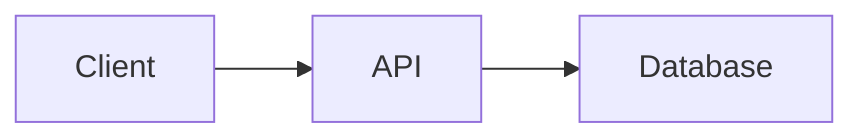
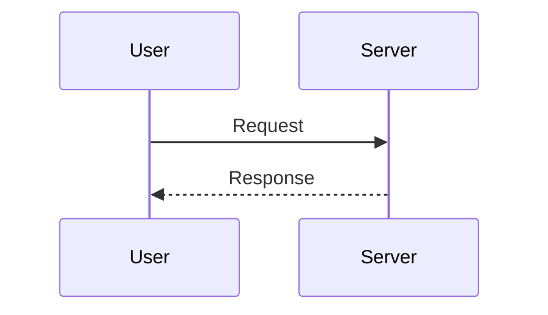

# Share Diagram

Generate shareable URLs for markdown documents with Mermaid diagrams.

## When to Use

- Sharing a POC or proof-of-concept document from a coding session
- Sharing architecture diagrams, flowcharts, sequence diagrams via Mermaid
- Sharing any markdown content (decisions, notes, code snippets) as a URL
- The user says "share this", "create a shareable link", or wants to send a document to someone

## How It Works

The markdown is stored as a Jazz CoValue on Jazz Cloud, owned by a public-readable group. The share URL carries only the CoValue id (`?id=co_xxx`). The viewer app at `https://gdorsi.github.io/shareable-diagrams/` loads the CoValue over WebSocket and renders it with Comark (markdown) and Mermaid (diagrams).

URLs are short regardless of document size. Documents created via this script are read-only on the web (the creator account is ephemeral).

## Steps

1. **Compose the markdown document** with clear structure:
   - Start with an `# Title` heading
   - Use `## Section` headings for organization
   - Include Mermaid diagrams in fenced code blocks with the `mermaid` language tag

2. **Write the content to a temporary file:**

Write the markdown to a `.md` file in the project's temp directory or `/tmp/`.

3. **Run the encode script:**

```bash
node skills/share-diagram/scripts/encode.mjs <path-to-file>
```

For just the CoValue id (no URL prefix):
```bash
node skills/share-diagram/scripts/encode.mjs --raw <path-to-file>
```

Or pipe via stdin:
```bash
cat <path-to-file> | node skills/share-diagram/scripts/encode.mjs
```

The script connects to Jazz Cloud, creates a public-readable CoValue, waits for sync, and prints the URL.

4. **Present the URL to the user.** Tell them:
   - Anyone with the URL can view the document
   - The document is stored on Jazz Cloud and loads on open
   - They can also visit https://gdorsi.github.io/shareable-diagrams/ to compose new documents interactively (those are editable from the creator's browser)

## Mermaid Diagram Examples

Flowchart:
````markdown

````

Sequence diagram:
````markdown

````

## Notes

- `encode.mjs` is a self-contained bundle with all dependencies inlined — it runs standalone with `node`, no `npm install` needed. Source lives in `encode.src.mjs`; rebuild with `npm run build:skill` from the repo root.
- Each run creates a fresh Jazz account on the fly, so documents shared this way cannot be edited later via the web UI.
