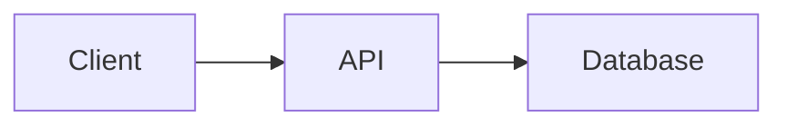
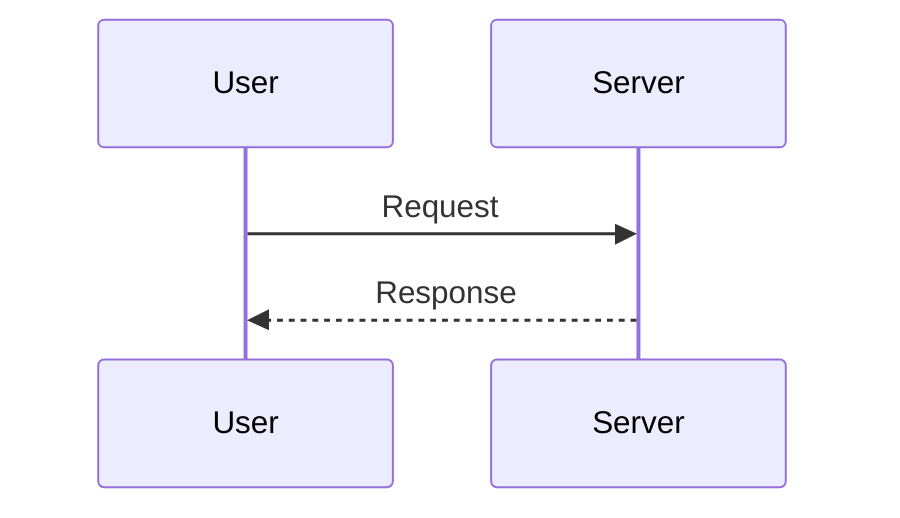

# Share Diagram

Generate self-contained, shareable URLs for markdown documents with Mermaid diagrams.

## When to Use

- Sharing a POC or proof-of-concept document from a coding session
- Sharing architecture diagrams, flowcharts, sequence diagrams via Mermaid
- Sharing any markdown content (decisions, notes, code snippets) as a URL
- The user says "share this", "create a shareable link", or wants to send a document to someone

## How It Works

The entire document is compressed (gzip) and encoded (base64url) into a URL hash fragment. The viewer app at `https://gdorsi.github.io/shareable-diagrams/` decodes and renders it with Comark (markdown) and Mermaid (diagrams). No server, no database — the document lives entirely in the URL.

## Steps

1. **Compose the markdown document** with clear structure:
   - Start with an `# Title` heading
   - Use `## Section` headings for organization
   - Include Mermaid diagrams in fenced code blocks with the `mermaid` language tag
   - Keep it concise — the encoded URL has practical limits (~32KB is safe)

2. **Write the content to a temporary file:**

Write the markdown to a `.md` file in the project's temp directory or `/tmp/`.

3. **Run the encode script:**

```bash
node skills/share-diagram/scripts/encode.mjs <path-to-file>
```

For just the hash (no URL prefix):
```bash
node skills/share-diagram/scripts/encode.mjs --raw <path-to-file>
```

Or pipe via stdin:
```bash
cat <path-to-file> | node skills/share-diagram/scripts/encode.mjs
```

4. **Present the URL to the user.** Tell them:
   - Anyone with the URL can view the document
   - No login or server required
   - The document is embedded in the URL itself
   - They can also visit https://gdorsi.github.io/shareable-diagrams/ to compose documents interactively

## Mermaid Diagram Examples

Flowchart:
````markdown

````

Sequence diagram:
````markdown

````

## Size Guidelines

- Keep documents under ~10KB of raw markdown for reliable sharing
- The gzip compression typically achieves 3-5x reduction
- URL sizes above ~32KB may not work in all browsers or chat apps
- If the document is too large, suggest splitting into multiple shared documents
