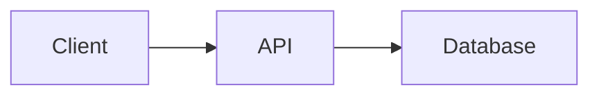
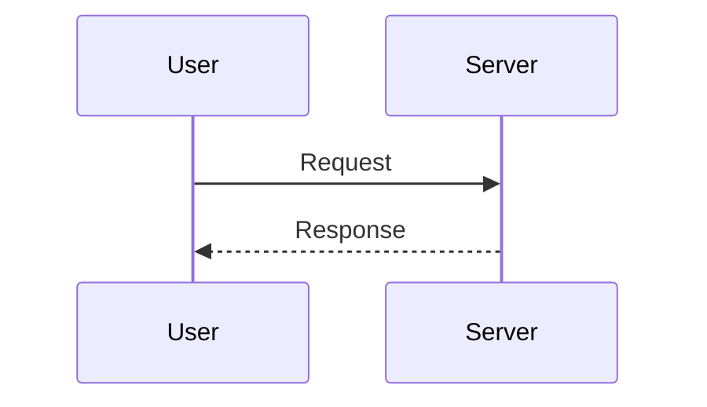

# Share Diagram

Generate shareable URLs for markdown documents with Mermaid diagrams.

## When to Use

- Sharing a POC or proof-of-concept document from a coding session
- Sharing architecture diagrams, flowcharts, sequence diagrams via Mermaid
- Sharing any markdown content (decisions, notes, code snippets) as a URL
- The user says "share this", "create a shareable link", or wants to send a document to someone

## How It Works

The markdown is stored as a Jazz2 row in the `documents` table. The share URL still carries only the document id (`?id=doc_xxx`). Documents created by the browser remain editable from that browser's local-first identity. Documents created by the script are read-only in the browser until the browser is granted owner-wide write access by the local grant server.

## Steps

1. Compose the markdown document.
2. Run the publish script:

```bash
node skills/share-diagram/scripts/encode.mjs <path-to-file>
```

For the raw document id:

```bash
node skills/share-diagram/scripts/encode.mjs --raw <path-to-file>
```

To also print a browser grant URL:

```bash
node skills/share-diagram/scripts/encode.mjs --grant <path-to-file>
```

3. If you need browser editing for script-owned docs, start the loopback grant server before opening the grant URL:

```bash
node skills/share-diagram/scripts/grant-server.mjs
```

4. Present the normal share URL to the user. Present the grant URL only when you want the current browser to gain edit access to all documents owned by the script identity.

## Mermaid Diagram Examples

Flowchart:
````markdown

````

Sequence diagram:
````markdown

````

## Notes

- `encode.mjs` and `grant-server.mjs` are bundled artifacts; rebuild them with `npm run build:skill`.
- The script identity is stable and stored in `~/.shareable-diagrams/script-identity.json`.
- Grant URLs are single-use and short-lived, and they use a URL fragment so the code is not sent as part of the page request.
